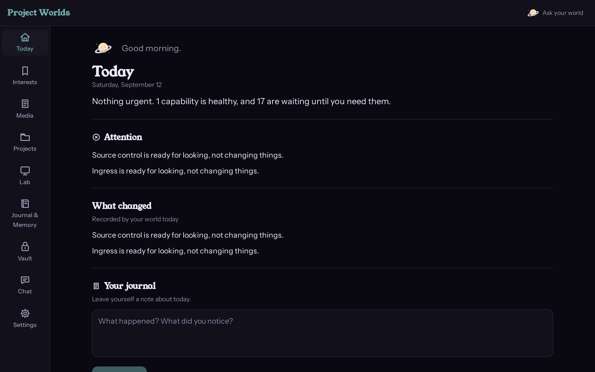
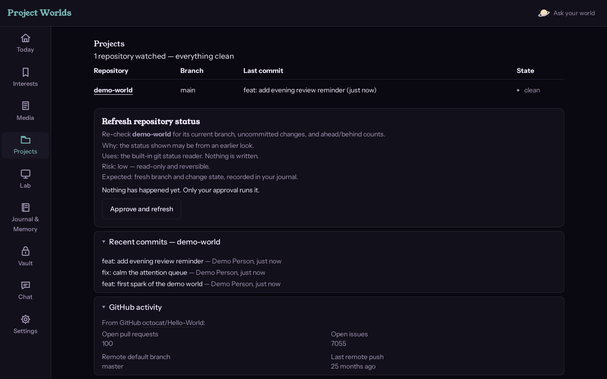
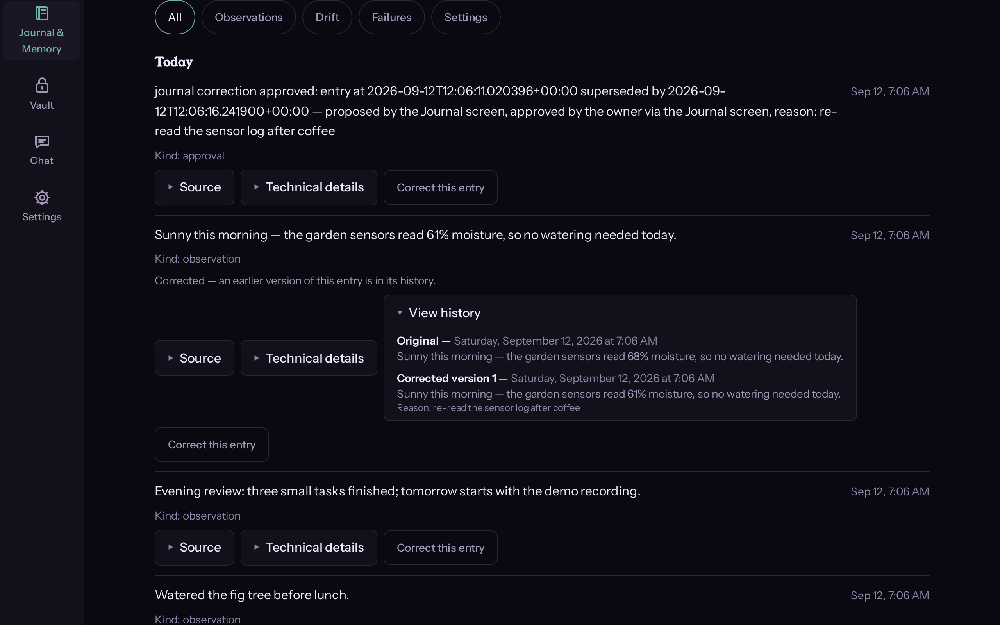
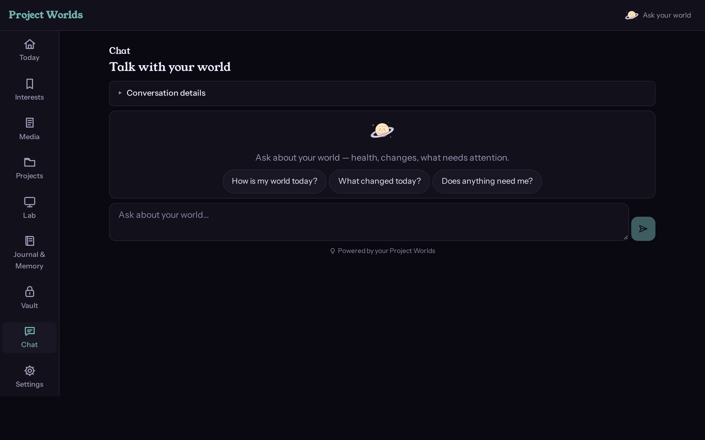
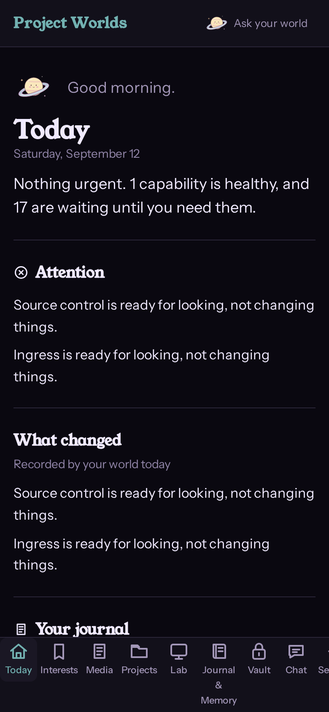

# Project Worlds

A calm, accessible personal environment where your information, tools,
assistant, history, and capabilities come together naturally — and where
sophisticated machinery stays out of your way until you actually need it.
Understandable at a glance when you can barely focus; fully inspectable
down to the technical guts when you want that instead.

**Stable truth. Replaceable machinery.** Project Worlds is the
environment; Personal World is the companion inside it. It answers a
person's actual questions — *what matters today, what changed, what
needs attention, what is my world allowed to do* — while the AI agent
observes and suggests but never silently decides. Your data stays on
your own hardware, portable and exportable.

## A Play-Nice product

This project adopts [Play-Nice Contracts](https://github.com/Rylee-Bee/play-nice-contracts)
as its shared cooperation and engineering constitution.

Here, Play-Nice governs how the four sides of Project Worlds cooperate
without stepping on each other: **Rylee** (the owner), **Personal World**
(the companion character inside the environment), the **agents and
models** that assist her, and the **providers, APIs, automation, and
interfaces** that orbit both of them. Truth and evidence, explicit
state, asking instead of guessing, provenance on consequential
decisions, recoverable mistakes, accessibility floors, bounded work,
and collaborative good faith are the cooperation floor — not the
product.

Project Worlds itself stays authoritative for its own architecture,
world data, UI and design language, domain behavior, Personal World's
companion behavior, the [finish-line product rules](docs/PERSONAL-WORLD-FINISH-LINE.md),
project-specific policies (cemented policies, journal correction with
preserved history, step-up approvals), and its implementation details
(Python package, CLI, web dashboard).

The canonical adoption lives at
[`.project/contracts/adoption.yaml`](.project/contracts/adoption.yaml);
canonical current state at [`.project/CURRENT.md`](.project/CURRENT.md);
durable decisions at [`.project/DECISIONS.md`](.project/DECISIONS.md).

## Screenshots

The real running application, captured from a sanitized demo world
(the repository names and journal entries are fixture data):

| | |
|---|---|
|  | Today — the calm overall environment |
|  | Projects — local Git truth with optional GitHub enrichment |
|  | Journal — correct the record without erasing the record |
|  | Assistant — contextual Personal World chat |



## What it does

- **Today** — the daily answer: what needs attention, what changed,
  recent journal entries. Calm when things are fine; specific when they
  are not.
- **Journal & Memory** — an append-only record of what happened in your
  world. Entries can be **corrected without erasing history**: approve a
  fix and the original stays inspectable forever, with the reason and
  who approved it.
- **Projects** — follows your local repositories: branch, uncommitted
  changes, ahead/behind, recent commits — all from local Git, which
  stays canonical. When the `gh` CLI is available, GitHub adds remote
  facts (open pull requests, open issues, default branch, last remote
  push). Without GitHub, Projects keeps working from local truth.
- **Assistant** — a companion chat that answers questions about your
  world from a read-only snapshot. It returns conversation text, never
  tool execution, and it can never act on its own.
- **World / Vault / Settings** — facts, intent, policies, and lore with
  explicit classification; an optional encrypted vault; presentation
  preferences, companions, and accessibility settings.

## How it works

- **A small durable core owns the truth**: observed facts, intent,
  policies, and the journal — with append-only records and provenance
  on everything.
- **Providers are optional and replaceable**: local Git answers source
  control by itself; GitHub, chat models, and other systems enrich it
  when present and degrade quietly when absent. Nothing mandatory
  hides behind "optional."
- **Explicit approval, always**: anything that changes your world runs
  through a propose → approve → act flow. The UI shows exactly what
  will happen and what has not happened yet ("Nothing has changed
  yet. Only your approval applies it"), the server enforces the
  step-up, and every approved act is journaled with full provenance.
- **History is never erased**: corrections append; originals stay
  inspectable with reasons and timestamps.

## Quick start

Requires Python 3.12 or newer and [uv](https://docs.astral.sh/uv/getting-started/installation/).

```bash
git clone https://github.com/Rylee-Bee/personal-world.git
cd personal-world
uv sync --frozen --extra test
uv run personal-world --config-dir config.local init
uv run personal-world --config-dir config.local daily
```

Then serve the dashboard with a token:

```bash
PW_API_TOKEN=$(python -c "import secrets; print(secrets.token_urlsafe(32))") \
PW_CONFIG_DIR=config.local \
uv run uvicorn personal_world.api:create_app --factory --app-dir src --port 8000
```

`data/` and `config.local/` are ignored runtime directories. Keep local
endpoints and credentials out of tracked examples. See
[Operations](docs/OPERATIONS.md) for container setup, tokens, and
network scope.

## What works today

Implemented in the current source, with repository tests and CI gates:

- World model, classification, cemented policies, CLI, daily loop,
  exports, and the framework validator; core operation does not
  require a provider.
- Dashboard pages **Today, Chat, World, Journal, Vault, Settings**,
  real data loading, explicit partial/error states, journal notes and
  kind filtering.
- Two propose→approve→act workflows, both server-enforced with
  step-up: a repository status refresh (Projects) and journal entry
  correction with preserved history (Journal).
- Projects workspace over local Git (branch, dirty, ahead/behind,
  history, per-repo provenance) with optional GitHub enrichment via
  the authenticated `gh` CLI — read-only, no credentials managed by
  the app, quiet degradation when GitHub is absent.
- Context-aware companion chat over a read-only world snapshot through
  Ollama or an OpenAI-compatible provider. It returns conversation
  text, not tool execution.
- Services launcher with an editable Apps registry, persistent
  reminders, five-step first-run setup wizard, and token
  login/bootstrap.
- Native Vault UI/API for unlock/lock, names, storage, and deletion.
  Encrypted storage requires the optional crypto dependency (included
  by the Dockerfile); minimal installs otherwise use an unencrypted
  fallback. See the
  [current secret boundary](docs/ARCHITECTURE.md#secrets-current-implementation-and-target).
- Local identity foundations: principal resolution, hashed tokens,
  per-user state paths. This is not complete SSO or household
  isolation.
- Theme manifest APIs; built-in companion/palette choices work.

Repository tests do not prove every external integration or deployed
user journey. The [Architecture](docs/ARCHITECTURE.md) records current
auth, Vault, state ownership, API, and backup limits. The
[finish line](docs/PERSONAL-WORLD-FINISH-LINE.md) defines the broader
target — those items are not completed by the current foundations.

## Container deployment

Pull the published image and run with a unique token:

```bash
export PW_API_TOKEN="$(python -c 'import secrets; print(secrets.token_urlsafe(32))')"
docker compose pull
docker compose up -d
```

Then:

```bash
docker compose ps
```

The portable base image (`compose.yaml`) carries no host paths; it
boots with only the image, a `world-data` volume, and the token. See
[Operations → Containers](docs/OPERATIONS.md#containers) for the full
deployment guide, including the optional homelab enrichment override
and rollback by SHA tag.

## Deeper documentation

| Interest | Entry point |
|---|---|
| Understand the application | [Architecture](docs/ARCHITECTURE.md) and [native baseline](docs/NATIVE-BASELINE-AND-ENRICHMENT.md) |
| Understand the target daily-use experience | [Project Worlds finish line](docs/PERSONAL-WORLD-FINISH-LINE.md) |
| Explore the design | [Handoff index](design/handoff/README.md) and [frame index](design/handoff/FRAME_INDEX.md) |
| Companions and animation | [Asset index](design/assets/README.md) |
| Everything, one page | [Documentation index](docs/INDEX.md) |
| Engineering constitution | [Play-Nice Contracts](https://github.com/Rylee-Bee/play-nice-contracts) |
| Run or configure it | [Operations](docs/OPERATIONS.md) and [providers](docs/PROVIDERS.md) |
| Contribute or get help | [Contributing and support](CONTRIBUTING.md) |
| Report a security concern | [Private security reporting](SECURITY.md) |

## Validation and license

```bash
uv run pytest --timeout=30
uv run personal-world framework validate --json
```

Licensed under [Apache-2.0](LICENSE). The project is experimental; see
the [security policy](SECURITY.md) for the current support and
deployment boundary.

